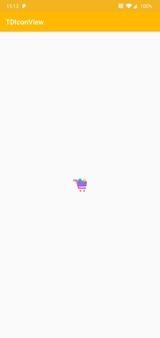

[  ](https://bintray.com/mobisummer/msmaven/tdshopsdk/_latestVersion)

# Android 端 SDK 接入指引

## 1. SDK 引入

### `Gradle` 依赖
1. 在**App**的 `build.gradle` 文件中加入

```groovy
dependencies {
    implementation 'com.tdshop.android:sdk:2.3.1'
}
```

> [版本更新内容及行为变更](docs/update.md)

> [TDShop SDK 收集的信息及获取的权限](docs/collect.md)

### `GIF` 支持
入口图片展示已支持 GIF，无需依赖第三方库

## 2. 初始化

我们提供了两种初始化方式，自动初始化和手动初始化。
> *推荐使用自动初始化，尽早地初始化可以加快商城打开的速度，提升用户体验，提高转化率。*

### 自动初始化

在 `AndroidManifest.xml` 中加入

```xml
    <provider
      android:authorities="${applicationId}.TDInitProvider"
      android:exported="false"
      android:name="com.tdshop.android.TDInitProvider"/>

    <meta-data
      android:name="com.tdshop.android.ApplicationId"
      android:value="<APP_ID>"/>

    <!--开启 Debug 模式-->
    <meta-data
      android:name="com.tdshop.android.IsDebugEnabled"
      android:value="true"/>
```

### 手动初始化

`sdkInitialize()`的`ActionCallback`会在主线程进行回调，调用可以保证初始化完成。

```java
    //开启 Debug 模式
    TDShop.setIsDebugEnabled(true);
    TDShop.sdkInitialize(context, APP_ID, new ActionCallback() {
      @Override
      public void onSuccess() {
      }

      @Override
      public void onFailed(Exception e) {
      }
    });
```


> **`APP_ID` 请联系商务获取。可先设置为 `myshop` 进行测试。**


## 3. 加载商城入口

目前提供的商城入口有
- Banner 图片入口 [TDBannerView](#tdbannerview)
- 图标图标入口 [TDIconView](#tdiconview)
- 插屏广告入口 [InterstitialView](#interstitialview)
- 自定义入口 [CreativeViewDelegate](#creativeViewDelegate)
- 自定义入口，根据标签返回多个素材 [MultiCreativeViewDelegate](#multiCreativeViewDelegate)
- 内嵌型商城入口  [TDShopContainer](#tdshopcontainer)

### TDBannerView

显示 Banner 图片，点击 Banner 会跳转至商城首页。

- **TDBannerView宽高比目前支持 720:372 (TDBannerView.TYPE_LARGE_BANNER) 与 320:50 (TDBannerView.TYPE_SMALL_BANNER) 两种尺寸**
- **LARGE_BANNER 测试用 pid:myshop_banner_001 **
- **SMALL_BANNER 测试用 pid:myshop_banner_002 **
- 支持 GIF
- 如果宽为精准尺寸高为最大尺寸，则会以宽为基准测量高。
- 如果高为精准尺寸宽为最大尺寸，则会以高为基准测量宽。
- 如果宽高都为精准尺寸，则不会按照比例测量
- 如果宽高都为未指定尺寸，则会按照原本图片大小测量


1. 在布局文件中添加 `TDBannerView`

```xml
  <com.tdshop.android.TDBannerView
    android:id="@+id/v_banner"
    app:td_placement_id="myshop_banner_001"
    android:layout_width="match_parent"
    android:layout_height="wrap_content"/>
```

2. 在 Java 代码中加载图片

```java
public class MainActivity extends AppCompatActivity {
    private CreativeView mBannerView;

      @Override
      protected void onCreate(Bundle savedInstanceState) {
          super.onCreate(savedInstanceState);
          ...
          mBannerView = findViewById(R.id.v_banner);
          // 1.设置PlacementId
          mBannerView.setPlacementId("myshop_banner_002");
          // 2.设置Banner尺寸类型
          mBannerView.setBannerType(TDBannerView.TYPE_SMALL_BANNER);
          // 3.设置回调监听器
          mBannerView.setCreativeViewListener(new CreativeViewListener() {
            @Override
            public void onCreativeError(TDShopException e) {

            }

            @Override
            public void onCreativeLoaded(View view) {
              // 5.显示 Banner
              mBannerView.show();
            }

            @Override
            public void onCreativeShowed(View view) {

            }

            @Override
            public void onCreativeClosed(View view) {

            }

            @Override
            public void onCreativeClicked(View view) {

            }
          });

          // 4.加载 Banner
          mBanner.load();

          // 如果不需要回调可以忽略3、4直接调用显示
          //mBanner.show();
      }
}
```

除了在 `xml` 中设置 `placementId` ，也可以调用`     mBanner.loadCreative(CreativeRequest.builder().placementId("placemenId").build());`在设置 `placementId`.

> **注意，初始化失败会导致图片加载不出来**


### TDIconView

显示 Icon 图片，点击 Icon 会跳转商城。

- **TDIConView宽高比例为1:1**
- **ICON 测试用 pid:myshop_icon_001 **
- 支持 GIF
- 如果宽为精准尺寸高为最大尺寸，则会以宽为基准测量高。
- 如果高为精准尺寸宽为最大尺寸，则会以高为基准测量宽。
- 如果宽高都为精准尺寸，则不会按照比例测量
- 如果宽高都为未指定尺寸，则会按照原本图片大小测量

1. 在布局文件中添加 `TDIconView`

```xml
  <com.tdshop.android.TDIconView
    android:id="@+id/v_icon"
    app:td_placement_id="myshop_icon_001"
    android:layout_width="match_parent"
    android:layout_height="wrap_content"/>
```

2. 在 Java 代码中加载图片

```java
public class MainActivity extends AppCompatActivity {
    private CreativeView mIconView;

      @Override
      protected void onCreate(Bundle savedInstanceState) {
          super.onCreate(savedInstanceState);
          ...
          mIconView = findViewById(R.id.v_icon);
          // 1.设置PlacementId
          mIconView.setPlacementId("myshop_icon_001")
          // 2.设置回调监听器
          mIconView.setCreativeViewListener(new CreativeViewListener() {
            @Override
            public void onCreativeError(TDShopException e) {

            }

            @Override
            public void onCreativeLoaded(View view) {
              // 4.显示 icon
              mIconView.show();
            }

            @Override
            public void onCreativeShowed(View view) {

            }

            @Override
            public void onCreativeClosed(View view) {

            }

            @Override
            public void onCreativeClicked(View view) {

            }
          });
          // 3.加载 Icon
          mIconView.load();

          // 如果不需要回调可以忽略2、3直接调用显示
          //mIconView.show();
      }

}
```

> **注意，初始化失败会导致图片加载不出来**

除了在 `xml` 中设置 `placementId` ，也可以调用`     mIcon.loadCreative(CreativeRequest.builder().placementId("placemenId").build());`加载特定`placementId`的图标。




### InterstitialView

显示插屏广告，只需在代码中调用即可。点击广告就会跳转商城。

- 支持 GIF

```java
TDShop.showInterstitialView(activity);
TDShop.showInterstitialView(activity,"placementId");
```


### CreativeViewDelegate

用于满足多入口和自定义控件或是其他宽高比例的入口的需求。需要自定义 View。

1. 在自定义View中的构造函数初始化`CreativeViewDelegate`

```java
  private CreativeViewDelegate mCreativeViewDelegate;

  public RectangularView(Context context) {
    this(context, null);
  }

  public RectangularView(Context context, @Nullable AttributeSet attrs) {
    this(context, attrs, 0);
  }

  public RectangularView(Context context,
      @Nullable AttributeSet attrs, int defStyleAttr) {
    super(context, attrs, defStyleAttr);
    mCreativeViewDelegate = new CreativeViewDelegate(this);
  }
```

也可利用 `CreativeViewDelegate(@NonNull Context context)` 进行构造，达到分离数据与视图的目的。

2. 在View展示的时候调用`performShow()`,可以在`onAttachedToWindow`中调用

```java
  @Override
  protected void onAttachedToWindow() {
    super.onAttachedToWindow();
    mCreativeViewDelegate.performShow();
  }
```

3. 在View消失的时候调用`performClosed()`,可以在`onDetachedFromWindow`中调用

```java
  @Override
  protected void onDetachedFromWindow() {
    super.onDetachedFromWindow();
    mCreativeViewDelegate.performClosed();
  }
```

4. 重写`performClick`方法
```java
  @Override
  public boolean performClick() {
    return mCreativeViewDelegate.performClick();
  }
```

5. 传入`placementId`，调用load加载, `placementId`请联系商务获取，可先用 `myshop_custom_001` 进行测试。
```java
  public void load(String id) {
    mCreativeViewDelegate.loadCreative(
        CreativeRequest.builder().placementId(id).build());
  }
```

6.获取素材
```java

  // 当加载失败或没有进行加载时会返回空
  CreativeMaterial creativeMaterial = mCreativeViewDelegate.getCreativeMaterialData();
  // 标题
  String title = creativeMaterial.getTitle();
  // 内容
  String content = creativeMaterial.getContent();
  // 图片url
  String url = creativeMaterial.getImageUrl();

```

### MultiCreativeViewDelegate
根据转入的PlacementId与标签数组tags返回多个入口数据

1. 在自定义View中的构造函数初始化`CreativeViewDelegate`

```java
  private MultiCreativeViewDelegate mMultiCreativeViewDelegate;

  public CustomBannerView(Context context) {
    this(context, null);
  }

  public CustomBannerView(Context context, @Nullable AttributeSet attrs) {
    this(context, attrs, 0);
  }

  public CustomBannerView(Context context,
      @Nullable AttributeSet attrs, int defStyleAttr) {
    super(context, attrs, defStyleAttr);
    mMultiCreativeViewDelegate = new MultiCreativeViewDelegate(this);
  }
```

2. 在View展示的时候调用`performShow()`,可以在`onAttachedToWindow`中调用

```java
  @Override
  protected void onAttachedToWindow() {
    super.onAttachedToWindow();
    mMultiCreativeViewDelegate.performShow();
  }
```

3. 在View消失的时候调用`performClosed()`,可以在`onDetachedFromWindow`中调用

```java
  @Override
  protected void onDetachedFromWindow() {
    super.onDetachedFromWindow();
    mMultiCreativeViewDelegate.performClosed();
  }
```

4. 执行`performClick`方法跳转商城，需要传入素材里面的CreativeId
```java

  @Override
  public boolean onBannerClick() {
    mMultiCreativeViewDelegate.performClick(
      mMultiCreativeViewDelegate.getCreativeMaterialData().get(position).getCreativeId());
  }
```

5. 传入`placementId`，调用load加载, `placementId`请联系商务获取，可先用 `myshop_tag_001` 进行测试。
```java
  public void load(String id, String... tags) {
    mMultiCreativeViewDelegate.loadCreative(
        CreativeRequest.builder().placementId(id).tags(tags).build());
  }
```

6.获取素材
```java
  // List 不为null, 当加载失败或没有进行加载时List会为empty
  List<CreativeMaterial> creativeMaterialList = mMultiCreativeViewDelegate
  	.getCreativeMaterialData();
```
### TDShopContainer
该类型入口会提供一个Fragment，把Fragment添加到Activity或ViewPager中即可展示商城


1. 创建一个TDShopContainer并调用init，会返回一个商城Fragment。
```java
  private TDShopContainer mTDShopContainer;

  Fragment containerFragment = mTDShopContainer.init(new HybridActionListener() {
    @Override
    public boolean onHybridRequestClose() {
      finish();
      return true;
    }
  });
```

2. 把Fragment添加到Activity或ViewPager中
```java
  // 请根据代码的实际情况进行调整
  getSupportFragmentManager()
    .beginTransaction()
    .replace(R.id.content, containerFragment)
    .commit();
```

3. 调用TDShopContainer.load，传入PlacementId与Callback(Callback可为空)进行加载.
```java
  mTDShopContainer.load(pid, new ActionCallback() {
    @Override
    public void onSucceed() {
      Toast.makeText(TDShopContainerActivity.this, "load success", Toast.LENGTH_SHORT)
        .show();
    }

    @Override
    public void onFailed(Exception e) {
      Toast.makeText(TDShopContainerActivity.this, "load failed", Toast.LENGTH_SHORT)
        .show();
      e.printStackTrace();
    }
  });
  // mTDShopContainer.load(pid, null);
```

## 4.Demo 下载
1. clone 本项目后运行
2. [下载 APK](https://github.com/mobisummer/tdshop-android-sdk-demo/releases)

## [5.更新日志](docs/update.md)
