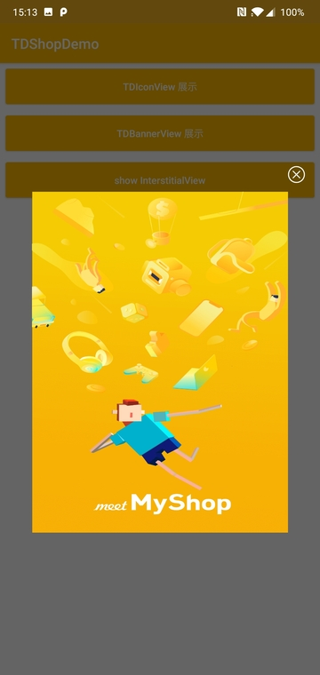

# Android 端 SDK 接入指引

## 1. SDK 引入

1.1 在**项目**的 `buidl.gradle` 加入

```
allprojects {
    repositories {
        google()
        jcenter()
        maven { url "https://raw.githubusercontent.com/mobisummer/tdshop-sdk-maven-repository/master" }
    }
}
```

1.2 在**模块**的 `build.gradle` 文件中加入

```
implementation 'com.tdshop.android:sdk:1.1.0'
```

> **最低支持 Android Sdk 19。 为了保证系统稳定性，目前不建议在低于 19 的环境运行。在低于 19 的环境下，可能会出现商城加载不了的问题。**

> [版本更新内容](docs/update.md)

## 2. 初始化

我们提供了两种初始化方式，自动初始化和手动初始化。
> *推荐使用自动初始化，尽早地初始化可以加快商城打开的速度，提升用户体验，提高转化率。*

### 自动初始化

在 `AndroidManifest.xml` 中加入

```xml
    <meta-data
      android:name="com.tdshop.android.ApplicationId"
      android:value="<APP_ID>"/>

    <!--开启 Debug 模式-->
    <meta-data
      android:name="com.tdshop.android.IsDebugEnabled"
      android:value="true"/>
```

### 手动初始化

`sdkInitialize()`的`ActionCallback`会在主线程进行回调，调用可以保证初始化完成。

```java
    //开启 Debug 模式
    TDShop.setIsDebugEnabled(true);
    TDShop.sdkInitialize(context, APP_ID, new ActionCallback() {
      @Override
      public void onSuccess() {
      }

      @Override
      public void onFailed(Exception e) {
      }
    });
```


> **`APP_ID` 请联系商务获取。可先设置为 `myshop` 进行测试。**


## 3. 加载商城入口

目前提供的商城入口有
- Banner 图片入口 [TDBannerView](#tdbannerview)
- 图标图标入口 [TDIconView](#tdiconview)
- 插屏广告入口 [InterstitialView](#interstitialview)
- 自定义入口 [CreativeViewDelegate](#creativeViewDelegate)

### TDBannerView

触发 `load()` 操作后加载图片，点击 Banner 会跳转至商城首页。

- **MidasBanner宽高比例为720:372**
- 如果宽为精准尺寸高为最大尺寸，则会以宽为基准测量高。
- 如果高为精准尺寸宽为最大尺寸，则会以高为基准测量宽。
- 如果宽高都为精准尺寸，则不会按照比例测量
- 如果宽高都为未指定尺寸，则会按照原本图片大小测量

> **暂时只能显示单一的入口图片**，多入口方案请查看[CreativeViewDelegate](#creativeViewDelegate)

1. 在布局文件中添加 `TDBannerView`

```xml
  <com.tdshop.android.TDBannerView
    android:id="@+id/v_banner"
    app:td_placement_id="test_banner_001"
    android:layout_width="match_parent"
    android:layout_height="wrap_content"/>
```

2. 在 Java 代码中加载图片

```java
public class MainActivity extends AppCompatActivity {
    private CreativeView mBannerView;

      @Override
      protected void onCreate(Bundle savedInstanceState) {
          super.onCreate(savedInstanceState);
          ...
          mBannerView = findViewById(R.id.v_banner);
          mBannerView.setCreativeViewListener(new CreativeViewListener() {
          @Override
          public void onCreativeError(TDShopException e) {

          }

          @Override
          public void onCreativeLoaded(View view) {
            //显示 Banner
            mBannerView.show();
          }

          @Override
          public void onCreativeShowed(View view) {

          }

          @Override
          public void onCreativeClosed(View view) {

          }

          @Override
          public void onCreativeClicked(View view) {

          }
        });
          //加载 Banner
          mBanner.load();
          //mBanner.show();//直接显示
          ...
      }
}
```

除了在 `xml` 中设置 `placementId` ，也可以调用`     mBanner.loadCreative(CreativeRequest.builder().placementId("placemenId").build());`在设置 `placementId`.

> **注意，初始化失败会导致图片加载不出来**


### TDIconView

触发 `load()` 操作后加载图片，点击 Icon 会跳转商城。

- **TDIConView宽高比例为1:1**
- 如果宽为精准尺寸高为最大尺寸，则会以宽为基准测量高。
- 如果高为精准尺寸宽为最大尺寸，则会以高为基准测量宽。
- 如果宽高都为精准尺寸，则不会按照比例测量
- 如果宽高都为未指定尺寸，则会按照原本图片大小测量

> **暂时只能显示单一的入口图片**，多入口方案请查看[CreativeViewDelegate](#creativeViewDelegate)

1. 在布局文件中添加 `TDIconView`

```xml
  <com.tdshop.android.TDIconView
    android:id="@+id/v_icon"
    app:td_placement_id="test_banner_001"
    android:layout_width="match_parent"
    android:layout_height="wrap_content"/>
```

2. 在 Java 代码中加载图片

```java
public class MainActivity extends AppCompatActivity {
    private CreativeView mIconView;

      @Override
      protected void onCreate(Bundle savedInstanceState) {
          super.onCreate(savedInstanceState);
          ...
          mIconView = findViewById(R.id.v_icon);
          mIconView.setCreativeViewListener(new CreativeViewListener() {
          @Override
          public void onCreativeError(TDShopException e) {

          }

          @Override
          public void onCreativeLoaded(View view) {
            //显示 icon
            mIconView.show();
          }

          @Override
          public void onCreativeShowed(View view) {

          }

          @Override
          public void onCreativeClosed(View view) {

          }

          @Override
          public void onCreativeClicked(View view) {

          }
        });
          //加载 Icon
          mIconView.load();
          //mIconView.show();//直接显示
          ...
      }

}
```

> **注意，初始化失败会导致图片加载不出来**

除了在 `xml` 中设置 `placementId` ，也可以调用`     mIcon.loadCreative(CreativeRequest.builder().placementId("placemenId").build());`加载特定`placementId`的图标。


### InterstitialView

显示插屏广告，只需在代码中调用即可。点击广告就会跳转商城。

```java
TDShop.showInterstitialView(activity);
TDShop.showInterstitialView("placementId");
```



> **暂时只能显示单一的入口图片**，多入口方案请查看[CreativeViewDelegate](#CreativeViewDelegate)

### CreativeViewDelegate

用于满足多入口和自定义控件或是其他宽高比例的入口的需求。需要自定义 View。

1. 在自定义View中的构造函数初始化`CreativeViewDelegate`

```java
  private CreativeViewDelegate mCreativeViewDelegate;

  public RectangularView(Context context) {
    this(context, null);
  }

  public RectangularView(Context context, @Nullable AttributeSet attrs) {
    this(context, attrs, 0);
  }

  public RectangularView(Context context,
      @Nullable AttributeSet attrs, int defStyleAttr) {
    super(context, attrs, defStyleAttr);
    mCreativeViewDelegate = new CreativeViewDelegate(this);
  }
```

2. 在View展示的时候调用`performShow()`,可以在`onAttachedToWindow`中调用

```java
  @Override
  protected void onAttachedToWindow() {
    super.onAttachedToWindow();
    mCreativeViewDelegate.performShow();
  }
```

3. 在View消失的时候调用`performClosed()`,可以在`onDetachedFromWindow`中调用

```java
  @Override
  protected void onDetachedFromWindow() {
    super.onDetachedFromWindow();
    mCreativeViewDelegate.performClosed();
  }
```

4. 重写`performClick`方法
```java
  @Override
  public boolean performClick() {
    return mCreativeViewDelegate.performClick();
  }
```

5. 传入`placementId`，调用load加载, `placementId`请联系商务获取，可先用 `myshop_custom_004` 进行测试。
```java
  public void load(String id) {
    mCreativeViewDelegate.loadCreative(
        CreativeRequest.builder().placementId(id).build());
  }
```

## Demo 下载
1. clone 本项目后运行
2. [下载 APK](https://github.com/mobisummer/tdshop-android-sdk-demo/releases)
